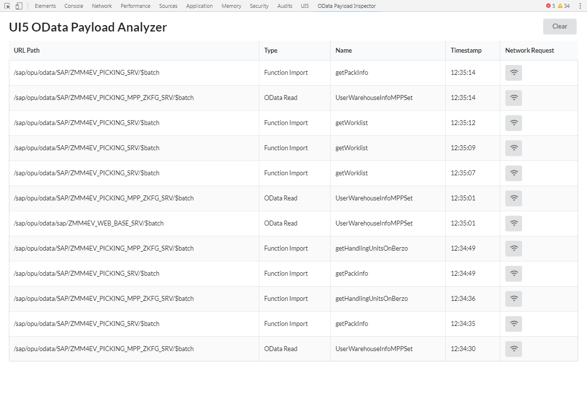
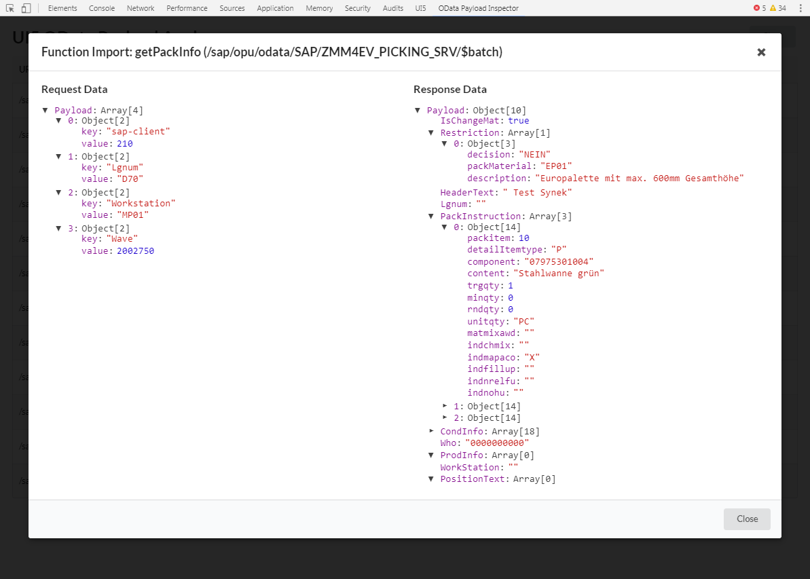

# chrome-odata-viewer

Displays the UI5 OData network requests in a beautified clickable way like JSON.

## Installation

Visit the [Chrome Web Store](https://chrome.google.com/webstore/detail/ui5-odata-payload-analyze/ifkpkiacjcogbgbgeopcnpknhbeofhop?hl=de) and install the extension `UI5 OData Payload Analyzer`.

## Development Installation

1. Clone the repository: `git clone https://github.com/mxschmitt/chrome-odata-viewer.git`
3. Install `webpack-cli` globally: `npm install -g webpack-cli` or `yarn global add webpack-cli`
2. Install the dependencies in the folder by running: `npm install` or `yarn install` in the directory
5. Install the unpacked extension in Chrome by clicking on the `LOAD UNPACKED` button and selecting the `dist` directory there

### Development Installation Requirements

- Chrome
- NPM / Yarn to install the necessary packages

## How to

To use this extension, you have to open the Chrome DevTools and open the `OData Payload Inspector` tab. Only if you have opened the tab once, backend calls will be recorded.

Here you can see an example OData read http call.

And here is a function import. On the left side is the request data which was sent to the backend and on the right the response data.
